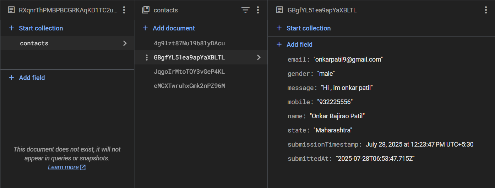

# Secure Contact Form with Firebase Integration

This project is a modern, responsive, and secure contact form built with **HTML**, **CSS**, and **JavaScript**. It integrates with **Google Firebase** to handle user authentication and store form submissions securely in a Firestore database.

---

## 🔒 Features

- **Responsive Design**  
  A clean, two-column layout that works seamlessly on desktops, tablets, and mobile devices.

- **Secure Data Storage**  
  Each user's submissions are stored privately in a separate collection in Firestore, accessible only to them and the project admin.

- **User-Friendly Interface**  
  Includes a success pop-up message upon successful form submission and clear input fields.

- **Firebase Backend**  
  Leverages Firebase for backend services:
  - **Firestore Database** for storing form data.
  - **Firebase Authentication** for silent, anonymous sign-in.
  - **Secure Key Management** with `.gitignore` and external config.

---

## 📸 Screenshots

### 1. Main Contact Form Page  

### 2. Success Submission Popup  

### 3. Data in Firebase Console  

---

## 🧱 Tech Stack

- **Frontend**: HTML5, CSS3, JavaScript (ES6 Modules)  
- **Backend**: Google Firebase  
  - Firestore Database  
  - Firebase Authentication  

---

